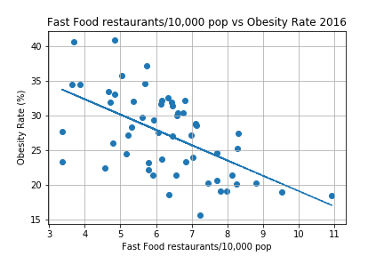
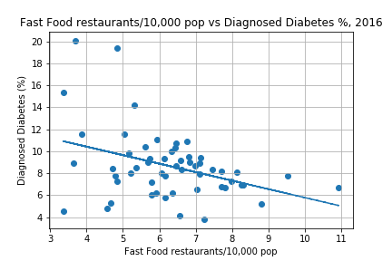
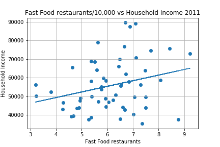
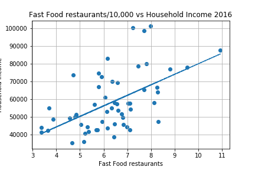

# Fast-Food-Analysis-California
Analyzing fast food chains against population demographics and health data in California

Project authors: Dominica Corless, Kelsey Cox, Jeremy Jang, Jeremy Steele, Stanley Tan

## Summary

### The Questions

* Is there any correlation between the number of fast food restaurants and health statistics and/or demographcs in California counties? 
* Are fast food restaurants inherently predatory and position themselves more prominently in counties with particular demographics?
* Are health concerns (like diabetes and obesity) that are most frequently associated with unhealthy eating like fast food higher in counties with more fast food restaurants?
* If there is little or no correlation with the number of fast food restaurants, then what else can we discover? Is there any other correlation between health and demographics?

### Overview Files and Folders

* [Project Presentation](Project/Fast_Food_Analysis_PP.pptx)
* [Write Up](Project/Write-Up.docx)

**Exploring the data in Jupyter Notebooks:**
* [Exploring the Data with Scatterplots Notebook](Analysis/chart_code_pretty.ipynb)
* [Bar Charts of California Socioeconomic Demographics](Analysis/Socioeconomic%20Status%20Data%20Cleaning.ipynb)
* [Heat maps of California County Data](Graphs/graph_examples_from_.ipynb)

**Data collection and cleaning:**
* [Combining Fast Food Data, then combining with health and demographics data](Analysis/DataCollection.ipynb)
* [Combining Fast Food Data with Diabetes and Obesity Data](Analysis/health_data.ipynb)
* [Collecting Census Data 2011](Census/Census_Data_2011.ipynb)
* [Collecting Census Data 2016](Census/Census_Data_2016.ipynb)

**Output Image Folders:**
* [Scatterplots](Analysis/Charts/)
* [Bar Charts of California Demographics vs. Obesity Rates](Analysis/bar_charts/)
* [Heat Maps of California by County](Graphs/california_by_county/)
* [Comparison Heat Maps](Graphs/combined/)

### The Data

We used several sources for the data, all governmental sources. Data on the number of fast food restaurants in each county in California came from [United States Department of Agriculture](https://www.ers.usda.gov/data-products/food-environment-atlas/go-to-the-atlas/). California Census Data came from the Census API using the [Census Package](https://github.com/datamade/census). Health data came from the [CDC](https://gis.cdc.gov/grasp/diabetes/DiabetesAtlas.html).

Revised and collected data we then used to draw conclusions can be found in:
* [All combined data on Census, Fast Food Restaurants, and Health](Analysis/data/census_health_ff_education.csv)
* [California Census Data 2011](Analysis/data/census_data_2011.csv)
* [California Census Data 2016](Analysis/data/census_data_2016.csv)
* [Fast Food and Health Data by County 2011 and 2016](Analysis/data/big_df.csv)
* [Fast Food Restaurants by County](Analysis/data/fast_food_combined_data.csv)
* [California County Population 2011 and 2016](Analysis/data/county_2011_2016.csv)

## The Analysis

### Any Correlation for Fast Food Restaurants with Health and Demographics?

#### Obesity Rate vs. Fast Food Restaurants per 10,000 Population

| 2011 | 2016 |
| ---- | ---- |
|  |  |
| R value: -0.3588707718009065 | R value: -0.5707195340440635 |
| R-squared value: 0.1287882308529783 | R-squared value: 0.32572078653947295 |

* Stronger correlation in 2016, though still moderate correlation, and the regression line suggests that obesity rates are higher in counties with fewer fast food restaurants for the population. What does this mean? Does it have something to do with limited choices of fast food restaurants?

#### Diabetes Rate vs. Fast Food Restaurants per 10,000 Population

| 2011 | 2016 |
| ---- | ---- |
|  |  |
| R value: -0.15058799370788611 | R value: -0.38130812673053355 |
| R-squared value: 0.022676743848966348 | R-squared value: 0.14539588751074864 |

* No significant correlation here.

#### Per Capita Income vs. Fast Food Restaurants per 10,000 Population

| 2011 | 2016 |
| ---- | ---- |
|  |  |
| R value: 0.397767101106243 | R value: 0.5266912680213057 |
| R-squared value: 0.15821866672246415 | R-squared value: 0.2774036918098909 |

* No significant correlation here. 2016 has moderate correlation and a regression line that suggests counties with higher per capita incomes have more choices of fast food restaurants.

#### Median Household Income vs. Fast Food Restaurants per 10,000 Population

| 2011 | 2016 |
| ---- | ---- |
|  |  |
| R value: 0.27834651117497866 | R value: 0.5526455240753612 |
| R-squared value: 0.07747678028328252 | R-squared value: 0.3054170752805306 |

* No significant correlation here. 2016 has moderate correlation and a regression line that suggests counties with higher household incomes have more choices of fast food restaurants.

#### Poverty Rate vs. Fast Food Restaurants per 10,000 Population

| 2011 | 2016 |
| ---- | ---- |
|  |  |
| R value: -0.19659993120697924 | R value: -0.2511834003081931 |
| R-squared value: 0.03865153295058897 | R-squared value: 0.06309310059038598 |

* No significant correlation here.

#### College Educated Rate vs. Fast Food Restaurants per 10,000 Population

| 2016 |
| ---- |
|  |
| R value: 0.5725099432278867 |
| R-squared value: 0.32776763509479806 |

* This chart suggests there is moderate correlation that counties with more college graduates have more choices of fast food restaurants.

#### Total Fast Food Restaurants vs. Total County Population

| 2011 | 2016 |
| ---- | ---- |
|  |  |
| R value: 0.9972661756369081 | R value: 0.9964866536107665 |
| R-squared value: 0.9945398250694645 | R-squared value: 0.9929856508243837 |

* Super strong correlation here suggests the number of fast food restaurants in a county is based purely on the size of the population.

### Obesity Rate by Demographics in California (Bar Charts)

#### Education

| 2011 | 2016 |
| ---- | ---- |
|  |  |

#### Per Capita Income

| 2011 | 2016 |
| ---- | ---- |
|  |  |

### Plotting Demographic Data vs. Obesity Rate

#### College Educated Rate vs. Obesity Rate

| 2016 |
| ---- |
|  |
| R value: -0.8120860848378118 |
| R-squared value: 0.6594838091872056 |

* Strong correlation here suggests that higher obesity rates in counties with fewer college graduates. Is it purely education based?

#### Per Capita Income vs. Obesity Rate

| 2011 | 2016 |
| ---- | ---- |
|  |  |
| R value: -0.7849292553105964 | R value: -0.7532467718723405
| R-squared value: 0.6161139358424474 | R-squared value: 0.5673806993361017 |

* Moderate correlation here, nearing strong correlation, suggests that college education and income could be connected with each other to have an impact on obesity rates.

### Plotting Demographic Data vs. Diagnosed Diabetes Rate

#### College Educated Rate vs. Diagnosed Diabetes Rate

| 2016 |
| ---- |
|  |
| R value: -0.5725881773413534 |
| R-squared value: 0.32785722083109314 |

* Moderate correlation here suggests there are more factors that impact diabetes rates than impact obesity.

#### Per Capita Income vs. Diagnosed Diabetes Rate, 2011

| 2011 | 2016 |
| ---- | ---- |
|  |  |
| R value: -0.5667164483041154 | R value: -0.5094481839187359 |
| R-squared value: 0.3211675327784311 | R-squared value: 0.2595374520980982 |

* Moderate correlation here suggests there are more factors that impact diabetes rates than impact obesity.

### Plotting Per Capita Income vs. College Educated Rate

| 2016 |
| ---- |
|  |
| R value: 0.9404077031123526 | 
| R-squared value: 0.8843666480730507 |

* Really strong correlation between per capita income and college education rates here compounds the theory that they are connected when looking at obesity rates.
* i.e. More education = better income; better income = easier to afford better healthcare/healthier food options.
* Given the graphs of this data against number of fast food restaurants, the next thing that would be interesting to explore is the profit fast food restaurants make in the differant counties, and see if that has any correlation with health and demographics.

### Mapping the Data Across the Counties

