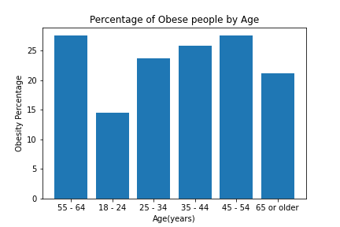
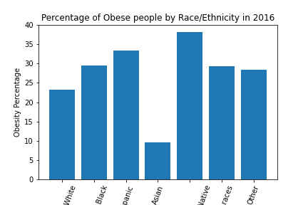
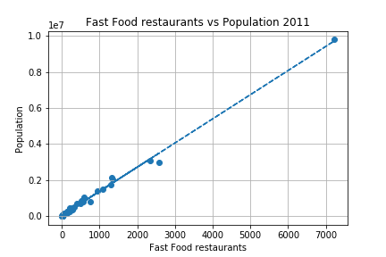
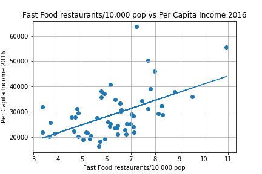
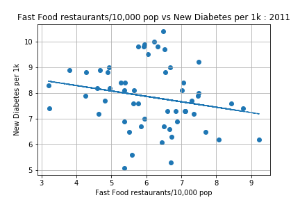
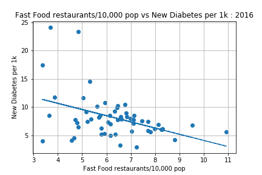
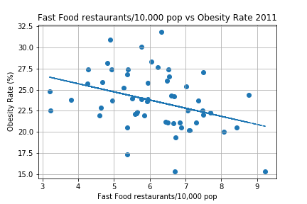
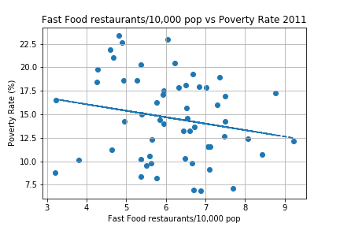
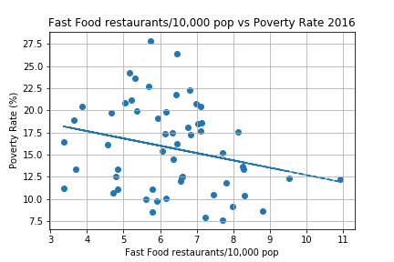
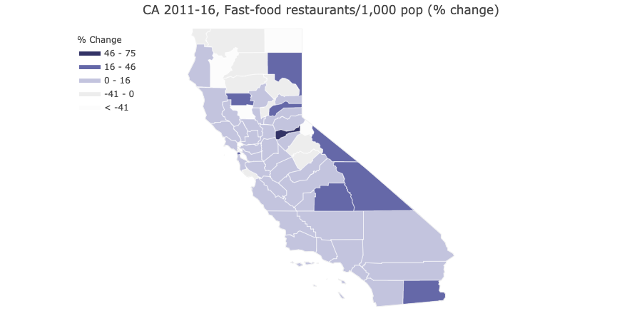

# Fast-Food-Analysis-California
Analyzing fast food chains against population demographics and health data in California

Project authors: Dominica Corless, Kelsey Cox, Jeremy Jang, Jeremy Steele, Stanley Tan

[Project Presentation](Project/Fast Food Analysis.pptx)

## The Data

We used several sources for the data, all governmental sources. Data on the number of fast food restaurants in each county in California came from [United States Department of Agriculture](https://www.ers.usda.gov/data-products/food-environment-atlas/go-to-the-atlas/). California Census Data came from the Census API using the [Census Package](https://github.com/datamade/census). Health data came from the [CDC](https://gis.cdc.gov/grasp/diabetes/DiabetesAtlas.html).

Revised and collected data we then used to draw conclusions can be found in:
* [All combined data on Census, Fast Food Restaurants, and Health](Analysis/data/census_health_ff_education.csv)
* [California Census Data 2011](Analysis/data/census_data_2011.csv)
* [California Census Data 2016](Analysis/data/census_data_2016.csv)
* [Fast Food and Health Data by County 2011 and 2016](Analysis/data/big_df.csv)
* [Fast Food Restaurants by County](Analysis/data/fast_food_combined_data.csv)
* [California County Population 2011 and 2016](Analysis/data/county_2011_2016.csv)

## The Analysis

### Obesity Rate by Demographics in California (Bar Charts)

### Plotting Diabetes Rate vs. Obesity Rate

R value: 0.7379222293613767

R-squared value: 0.5445292165856643

R value: 0.6541529316861476

R-squared value: 0.42791605803358174

### Plotting Per Capita Income vs. College Educated Rate

R value: 0.9404077031123526

R-squared value: 0.8843666480730507

### Plotting Demographic Data vs. Obesity Rate

#### Per Capita Income vs. Obesity Rate, 2011

R value: -0.7849292553105964

R-squared value: 0.6161139358424474

#### Per Capita Income vs. Obesity Rate, 2016

R value: -0.7532467718723405

R-squared value: 0.5673806993361017

#### College Educated Rate vs. Obesity Rate, 2016

R value: -0.8120860848378118

R-squared value: 0.6594838091872056

#### Unemployment Rate vs. Obesity Rate, 2011

R value: 0.25256780628906106

R-squared value: 0.06379049677366867

#### Unemployment Rate vs. Obesity Rate, 2016

R value: 0.5316690237368231

R-squared value: 0.2826719508012666

### Plotting Demographic Data vs. Diagnosed Diabetes Rate

#### College Educated Rate vs. Diagnosed Diabetes Rate, 2016

R value: -0.5725881773413534

R-squared value: 0.32785722083109314

#### Unemployment Rate vs. Diagnosed Diabetes Rate, 2011

R value: 0.1790753346455579

R-squared value: 0.032067975478418546

#### Unemployment Rate vs. Diagnosed Diabetes Rate, 2016

R value: 0.29152483905513416

R-squared value: 0.08498673178612187

#### Per Capita Income vs. Diagnosed Diabetes Rate, 2011

R value: -0.5667164483041154

R-squared value: 0.3211675327784311

#### Per Capita Income vs. Diagnosed Diabetes Rate, 2016

R value: -0.5094481839187359

R-squared value: 0.2595374520980982

### Plotting Demographic and Health Data vs. Fast Food Restaurants per 10,000 Population

#### Total Fast Food Restaurants vs. Total County Population, 2011

R value: 0.9972661756369081

R-squared value: 0.9945398250694645

#### Total Fast Food Restaurants vs. Total County Population, 2016

R value: 0.9964866536107665

R-squared value: 0.9929856508243837

#### Median Household Income vs. Fast Food Restaurants per 10,000 Population, 2011

R value: 0.27834651117497866

R-squared value: 0.07747678028328252

#### Median Household Income vs. Fast Food Restaurants per 10,000 Population, 2016

R value: 0.5526455240753612

R-squared value: 0.3054170752805306

#### College Educated Rate vs. Fast Food Restaurants per 10,000 Population, 2016

R value: 0.5725099432278867

R-squared value: 0.32776763509479806

#### Diabetes Rate vs. Fast Food Restaurants per 10,000 Population, 2011

R value: -0.15058799370788611

R-squared value: 0.022676743848966348

#### Diabetes Rate vs. Fast Food Restaurants per 10,000 Population, 2016

R value: -0.1791024539510132

R-squared value: 0.03207768901127481

#### Per Capita Income vs. Fast Food Restaurants per 10,000 Population, 2011

R value: 0.397767101106243

R-squared value: 0.15821866672246415

#### Per Capita Income vs. Fast Food Restaurants per 10,000 Population, 2016

R value: 0.5266912680213057

R-squared value: 0.2774036918098909

#### New Diabetes Diagnosis per 1K Population vs. Fast Food Restaurants per 10,000 Population, 2011

R value: -0.21390288619638717

R-squared value: 0.04575444472314456

#### New Diabetes Diagnosis per 1K Population vs. Fast Food Restaurants per 10,000 Population, 2016

R value: -0.4192249412583733

R-squared value: 0.17574955137308654

#### Obesity Rate vs. Fast Food Restaurants per 10,000 Population, 2011

R value: -0.3588707718009065

R-squared value: 0.1287882308529783

#### Obesity Rate vs. Fast Food Restaurants per 10,000 Population, 2016

R value: -0.5707195340440635

R-squared value: 0.32572078653947295

#### Poverty Rate vs. Fast Food Restaurants per 10,000 Population, 2011

R value: -0.19659993120697924

R-squared value: 0.03865153295058897

#### Poverty Rate vs. Fast Food Restaurants per 10,000 Population, 2016

R value: -0.2511834003081931

R-squared value: 0.06309310059038598

#### Unemployment Rate vs. Fast Food Restaurants per 10,000 Population, 2011

R value: -0.4074183720553898

R-squared value: 0.16598972988826402

#### Unemployment Rate vs. Fast Food Restaurants per 10,000 Population, 2016

R value: -0.5967618843920007

R-squared value: 0.35612474666309163

#### Median Age vs. Fast Food Restaurants per 10,000 Population, 2011 & 2016

### Mapping the Data Across the Counties

